# Vision AI를 활용한 거북목, 안구건조증 예방, 포즈 스마트


## 💁🏻 About Project

### 경험하고, 성장한 것들(2022.02 ~ 2022.04)

- Python을 활용한 AI 모델 서버 연동(자세, 눈 깜박임 탐지)
- 얼굴인식 Face ID(사용자의 얼굴 비교)
- Dlib 선정 및 활용
- Mysql + MongoDB, DB 이원화
- Django DRF, Django ORM, MongoDB, Mysql를 이용한 서버 Application 개발
- Pytest를 활용한 테스트 코드 구현 및 AI 응답시간 측정
- AWS(EC2), Nginx, Gunicorn을 활용한 배포
- Docker Hub / Jenkins / Docker를 활용한 CI/CD

<br>

### 사용 기술

- Python, Django DRF, Mysql, Django ORM
- Pytest
- AWS(EC2), Nginx, Gunicorn
- Git / Docker Hub / Jenkins / Docker

<br>

## 📦 Python을 활용한 AI 모델 서버 연동

### AI 모델 로직

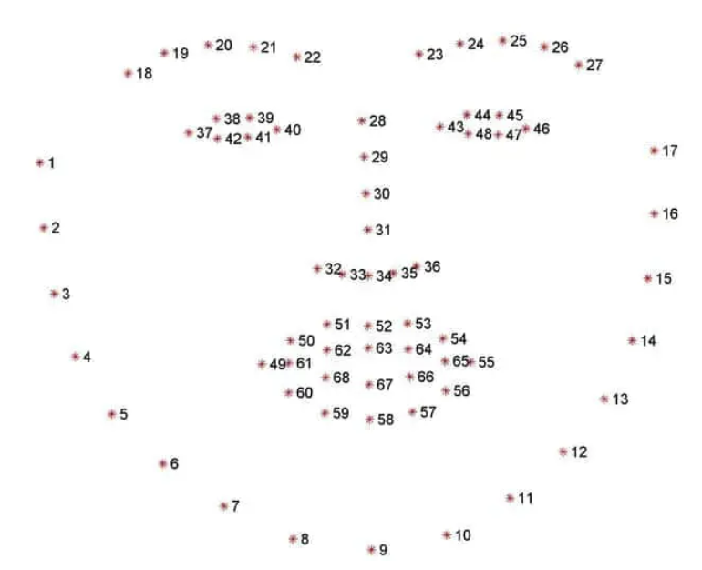

- 얼굴 데이터 입력
  - numpy.ndarray[(row,cols,3), uint8]
- 얼굴 랜드마크 생성
  - 왼쪽 눈 : landmark_list[42:48]
  - 오른쪽 눈 : landmark_list[36:42]
  - 왼쪽 뺨 : landmark_list[0:4]
  - 오른쪽 뺨 : landmark_list[13:17]
  - 코 : landmark_list[31:36]
- 랜드마크 활용하여 거북목 및 눈 깜박임 감지

<br>

### 데이터 전처리

- Frontend에서 영상에 대한 캡처 (형식 포함한 blob 데이터) ⇒ base64 인코딩
- Backend에서 base64 인코딩 된 데이터 전송 받음 ⇒ 형식 제외한 온전한 base64로 변환
  - `serializer.data.get("base64_blob")[22:]`
- blob 데이터로 decode
  - `base64.b64decode(image_string)`
- numpy uint8 형식으로 변환
  - `np.frombuffer(image_data, np.uint8)`
- 3차원(컬러이미지)로 변환
  - `cv.imdecode(nparr, cv.IMREAD_COLOR)`

<br>

### 랜드마크 생성

- 얼굴 탐지

  - `dlib.get_frontal_face_detector(frame,0)[0]`

- 형태 탐지

  - `dlib.shape_predictor(face)`

- 각 형태마다 x, y 좌표 append

  ```python
  landmark_list = []
  for p in shape.parts():
    landmark_list.append([p.x, p.y])
  ```

<br>

### 거북목 탐지

- 왼쪽 뺨과 오른쪽 뺨 평균 x 좌표를 통한 x 얼굴 크기 측정 (이후에 기준 값과 측정 값 비교를 통해 거북목 탐지)
  - `left_cheek_x = *sum*(*list*(*map*(*lambda* x: x[0], landmark_list[13:17]))) / 4`
  - `right_cheek_x = *sum*(*list*(*map*(*lambda* x: x[0], landmark_list[0:4]))) / 4`
  - `get_face_x = left_cheek_x - right_cheek_x`

- 왼쪽 눈, 오른쪽 눈, 코의 평균 y좌표를 통해 y얼굴 위치 측정
  - `right_eye_y = *sum*(*list*(*map*(*lambda* x: x[1], right_eye))) / 6`
  - `left_eye_y = *sum*(*list*(*map*(*lambda* x: x[1], left_eye))) / 6`
  - `nose_y = *sum*(*list*(*map*(*lambda* x: x[1], landmark_list[31:36]))) / 5`
  - `get_face_y = (right_eye_y + left_eye_y + nose_y) / 3`

- 코와 얼굴 중간간의 거리 측정 (이후에 고개를 숙였는지 들었는지 비교 가능)
  - `dist_nose_to_face_center = *abs*(nose_y - get_face_y)`

- 얼굴이 내려가는 경우 탐지
  - `get_face_y > (face_y_mean + nose_mean) * 1.02`
- 가까워 지는 경우 탐지
  - `face_x_mean * 1.05 <= get_face_x`
- 얼굴이 멀리 가면 거북목이 아니라는 가정 하에 거북목 예외 처리
  - *`if* down *and* face_x_mean * 0.85 > get_face_x:``y_result = *True`*
- 고개가 삐딱한 자세 탐지
  - `90 + (np.arctan2(left_eye_y - right_eye_y, left_eye_x - right_eye_x) * 180) / np.pi`
  - *`if* angle > 100 *or* angle < 80: x_result =*False*`

<br>

### 눈 깜박임 감지

- 랜드마크 생성은 거북목 탐지와 동일
  - `left_eye = landmark_list[42:48]`
  - `right_eye = landmark_list[36:42]`
- 눈의 위쪽 좌표와 아래쪽 좌표의 차이를 계산
  - `dist.euclidean(eye[1], eye[5])`
  - 눈의 평균 값 계산
    - `ear = (A + B) / (2.0 * C)`
  - 양쪽 눈의 평균 값 계산
    - `(leftEAR + rightEAR) / 2.0`
- 해당 차이 값이 설정 값 밑으로 내려가면 눈 깜박임으로 판단
  - `EYE_AR_THRESH = 0.27`
  - *`if* ear < EYE_AR_THRESH: res =*True*`

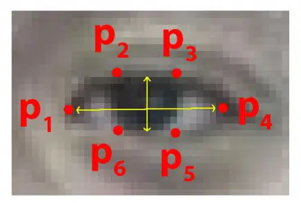

<br>

## 📦 얼굴인식 Face ID

### AI 모델 로직

1. 이미지의 단순화된 버전을 만들어 주는 HOG(Histogram of Oriented Gradient) 알고리즘을 활용해 방향성을 단순화한 이미지 생성
2. 얼굴의 주요 랜드마크를 찾아 얼굴의 포즈를 알아낸 후, 이를 이용해 눈과 입이 중앙에 오도록 이미지를 변형
3. 얼굴의 특징들을 측정하는 방법을 알고 있는 신경망에 중심을 맞춘 얼굴 이미지를 전달 ⇒ 128개의 측정값을 저장
4. 과거에 측정해 놓은 모든 얼굴에 대해, 이 얼굴의 측정값에 가장 가까운 사람이 누구인지 확인


<br>

#### [accounts.](http://accounts.users.py)models.py 유저 테이블에 128차원 백터 및 몇장의 사진이 들어갔는 지를 저장하도록 생성

```python
class User(AbstractUser):
  ...
  vector_list = models.TextField(default=str([0 for _ in range(128)]))
  vector_cnt = models.IntegerField(default=0)
```


#### 거북목 측정(1초 간격)으로 Base64된 사진 데이터가 넘어올 때마다 해당 인물의 백터 값을 갱신

```python
new_vector = face_landmark.get_average_vector(image_3darray)

IDENTITY_THRESHOLD = 0.45

standard_vector = list(map(float, user.vector_list[1:-1].split(","))) # 기존 유저
# 백터 간 유클리디안 거리 계산
distance = np.linalg.norm(np.array(new_vector) - np.array(standard_vector), axis=0)

if new_vector: # 얼굴이 감지되고
  # 최초랑 얼굴이 비교적 가까울 때만 학습
  if (standard_vector == [0 for _ in range(128)]) or (distance < IDENTITY_THRESHOLD):
    vector_list = list(map(float, user.vector_list[1:-1].split(",")))
    vector_cnt = user.vector_cnt
    new_vector_cnt = vector_cnt + 1
    
    vector_list = [i * vector_cnt for i in vector_list]
    res_vector_list = [(vector_list[i] + new_vector[i]) / new_vector_cnt for i in range(128)]
    
    user.vector_list = str(res_vector_list)
    user.vector_cnt = new_vector_cnt
    user.save()
```

- new_vector : 들어온 사진을 통해 랜드마크를 활용하여 생성된 128차원 백터 (뒤에서 로직 설명)
- IDENTITY_THRESHOLD : 기존의 백터 값과 너무 다를 경우에는 학습하지 않음(동일인이 아닐 확률이 높음)
- standard_vector : 기존에 해당 유저에 저장된 백터 값 (현재까지 학습된 총 백터 값의 평균)
- distance : np.linalg.norm(새로운 사진 - 기존 사진)을 통해 백터 간 거리를 환산
- 로직
  - (기존 평균 백터 값 * 사진 수 + 새로 들어온 백터 값 * 1장) / (사진수 + 1장)으로 각 요소를 최신화
  - 최신화 된 리스트를 String형태로 바꾸고, vector_cnt를 최신화해주고 해당 유저 테이블 업데이트


### 들어온 사진을 랜드마크를 활용하여 128차원 백터로 리턴

사진 데이터 전처리는 거북목, 눈 깜박임과 동일

- face_landmark.get_average_vector.py

  ```python
  data_file = "detections/ai_models/shape_predictor_68_face_landmarks.dat"
  detector = dlib.get_frontal_face_detector()
  predictor = dlib.shape_predictor(data_file)
  # 얼굴 인식
  facerecog = dlib.face_recognition_model_v1('detections/ai_models/dlib_face_recognition_resnet_model_v1.dat') 
  
  def get_average_vector(frame):
      face_detector = detector(frame, 0)
      if len(face_detector) == 0:
          return False  # 검출된 얼굴 없는 경우 False 리턴
  
      shapes = []
      for face in face_detector: # 얼굴이 1개밖에 없다는 가정
          shape = predictor(frame, face)  # 얼굴을 기준으로 랜드마크 좌표가 담긴 object 저장
          shapes.append(shape)
  
      for shape in shapes:
          return list(facerecog.compute_face_descriptor(frame, shape))
  ```

- face_detector : 새로운 랜드마크 생성

- 검출된 이미지가 없는 경우 False 리턴

- 1장만 들어오므로 face_detector에서 랜드마크 한 세트를 꺼내어 predictor를 통해 shapes에 저장

- 해당 shapes에서 facerecog.compute_face_descriptor를 통해 128차원 백터를 환산하여 리턴


## 📦 Dlib 선정 및 활용

### 일반적으로 얼굴 검출에 사용되는 도구

- **OpenCV Haar Cascades Face Detector**

  - 머신러닝 기반의 객체 검출 알고리즘

  - 검출 대상이미지를 Positive Image, 그 외 이미지를 Negative Image로 구분하여 훈련

  - 장점

    - 간단한 아키텍처로 다양한 이미지를 감지, 인식속도가 빠름

  - 단점

    - 정면이 아닌 이미지에는 작동하지 않음

    

- **Dlib**

  - C++로 작성된 이미지 처리 라이브러리로 python 패키지도 지원

  - HOG(Histogram of Oriented Gradients) 기반으로 얼굴 검출

    - HOG는 이미지 픽셀이 주변 픽셀과 비교하여 얼마나 어두운지를 알아냄
    - 밝은 부분에서 어두어지는 부분의 흐름을 알아내고, 이미 훈련된 얼굴 이미지로부터 추출된 HOG 패턴과 유사한 부분을 얼굴으로 인식하여 얼굴의 위치를 알 수있게 됨

  - 장점

    - 정면이미지가 아닌 이미지에도 작업할 수 있으며 CPU를 이용한 방법 중 가장 빠름

  - 단점

    - 80*80 보다 작은 크기의 얼굴은 감지하지 못함
    - 턱, 이마 일부를 제외하여 인식하는 경우가 있음

    

- **MTCNN**(Multi-task Cascaded Convolutional Neural Network)

  - CNN을 사용하여 얼굴을 표현하는 복잡한 특징들을 학습하여 성능 향상을 이룸

  - 장점

    - GPU에서 빠르게 작동하고 다양한 방향, 다양한 크기의 얼굴에 대해서 감지
    - 위 두 방법보다 정확한 결과를 제공

  - 단점

    - 상대적으로 느림

    

### Dlib 라이브러리를 선택한 이유

- CPU, GPU 및 시간 등의 자원을 많이 소요하지 않는 Dlib를 이용하기로 하였다.
- **MTCNN**는 얼굴 탐지 성능은 좋았으나 속도가 느렸고, 얼굴의 landmark를 눈, 코, 입 4개의 점만을 반환해주는데, 프로젝트에 활용하기에는 부족하다고 판단
- 프로젝트에 등장할 사람은 큰 동작 없을 것이라 예상되므로, Dlib 정도의 정확도로 충분히 서비스를 제공할 수 있을것이라 판단
- 거북목, 눈 깜박임을 파악하기 위해서는 68개의 랜드마크를 반환하는 dlib 라이브러리가 적합


## 📦 Mysql + MongoDB, DB 이원화

>  기존 RDBMS로 사용하던 Mysql + 1초당 Base64 인코딩한 사진 데이터를 Mongodb에

#### Mongo DB 사용 이유

- 스키마를 자주 변경해야하는 상황에 알맞음
  - 데이터가 아까워 저장하고 싶었다. 해당 데이터로 무엇을 할지 정해지지 않은 상황, 스키마가 변경될 가능성이 다분했다.
- 저장 구조 및 인덱싱이 용이
  - 프로젝트에서 원하는 방식은 유저 한명당 인스턴스를 생성하고, 해당 인스턴스중 하나인 Array에 Blob데이터를 저장하는 것이었다. 이 구조는 MongoDB의 저장구조와 유사했고, 따라서 인덱싱도 용이했다.
- 해당 데이터에 대한 수정과 삭제가 이루어지지 않는 점
  - 각 유저당 1초당 Base64 인코딩된 사진 한 장은 데이터 사이즈가 커질 것으로 예상했다.
  - 해당 데이터를 조회할 때 빠른 속도로 조회하고 싶었다.


### Mongo DB 적용 - Djongo

#### Djongo 사용 이유

- Django-MongoDB 간의 Object Mapper인 Djongo
- Django ORM을 사용하고 있었고, 해당 ORM을 그대로 사용하면서 적용

#### 과정

- 설치

  - `pip install djongo`
  - `pip install pymongo`

- settings.py - DATABASES 추가

  ```python
  # Deploy
  DATABASES = {
      'default': {
          'ENGINE': 'django.db.backends.mysql',
          'NAME': 'posesmart',
          'USER': 'posesmart',
          'PASSWORD': '8888',
          'HOST': '3.38.193.177',
          'PORT': '3306',
      },
      'mongodb': {
          'ENGINE': 'djongo',
          'NAME': 'mongos', # App Name
          'CLIENT': {
              'host': '3.38.193.177',
          }
      }
  }
  ```

  

- settings.py - mongodb 설정 추가 (APP 및 라우터 설정파일 매핑)

  ```python
  # MongoDB routers.py 경로 추가
  DATABASE_APPS_MAPPING = {'mongos': 'mongodb'}
  DATABASE_ROUTERS = ['mongos.routers.TestRouter']
  ```

  

- 적용 APP 내 [routers.py](http://routers.py) 추가

  ```python
  class TestRouter:
      """
      mongotest 앱의 모델에서 수행되는 모든 데이터베이스 연산을 제어하는 중계기
      """
  
      def db_for_read(self, model, **hints):
          """
          mongotest 앱의 모델을 조회하는 경우 mongodb로 중계한다.
          """
          if model._meta.app_label == 'mongos':
              return 'mongodb'
          return None
  
      def db_for_write(self, model, **hints):
          """
          mongos 앱의 모델을 기록하는 경우 mongodb로 중계한다.
          """
          if model._meta.app_label == 'mongos':
              return 'mongodb'
          return None
  
      def allow_relation(self, obj1, obj2, **hints):
          """
          mongos 앱의 모델과 관련된 관계 접근을 허용한다.
          """
          if obj1._meta.app_label == 'mongos' or \
                  obj2._meta.app_label == 'mongos':
              return True
          return None
  
      def allow_migrate(self, db, app_label, model_name=None, **hints):
          """
          mongos 앱의 모델에 대응하는 표가 mongodb 데이터베이스에만 생성되도록 한다.
          """
          if app_label == 'mongos':
              return db == 'mongodb'
          return None
  ```

  

- [Models.py](http://Models.py) 작성 - 추상클래스 작성 및 해당 클래스나 다른 클래스로 스키마 구성

  ```python
  from django.db import models as django_models
  from djongo import models as djongo_models
  from django.contrib.postgres.fields import ArrayField
  
  class Blob(django_models.Model):
      user_pk = django_models.IntegerField(null=True)
      user_base64 = ArrayField(django_models.TextField(null=True, default=[]))
  
      class Meta:
          abstract = True
  
  class Mongo(djongo_models.Model):
      _id = djongo_models.ObjectIdField()
      blob_base64 = djongo_models.ArrayField(null=True, model_container=Blob)
  
      class Meta:
          app_label = 'mongos'
  ```

  

- 생성 및 조회 적용 (일반 ORM 구성 및 Mongo DB식 생성 (instance = [{”name”:”value”}]))

  ```python
  mongo = Mongo.objects.filter(blob_base64={"user_pk": request.user.pk})
  
  if mongo:
    mongo[0].blob_base64[0].get("user_base64").append(image_base64)
    mongo[0].save()
  else:
    mongo = Mongo()
    mongo.blob_base64 = [{"user_pk":request.user.pk, "user_base64": [image_base64]}]
    mongo.save()
  ```


<br>

#### 🍋 트러블 슈팅

- 기존 객체에 내용 추가 시, **[Abstract models cannot be instantiated for models for retrieving data](https://stackoverflow.com/questions/67651203/django-abstract-models-cannot-be-instantiated-for-models-for-retrieving-data) 에러 발생**

  - 원인
    - Django 3.2 버전 이상부터 클래스 모델에 추상 모델이 실체화 될 수 없는 것을 체크하게 됨
  - 해결
    - 쓰고 있던 버전은 Django 3.4, 따라서 Django 3.1.12 버전으로 다운그레이드 하여 해결
  - 결과
    - 기존 ORM 방식 및 Djongo 공식문서 상 문법으로 인스턴스 생성 및 조회, 수정 가능

- 도커 이미지를 통한 배포시 이미지가 생성되지 않는 이슈 발생

  - 원인

    - Django 3.1.12 버전과 Djongo 1.3.6 버전이 모두 sqlparse 라이브러리를 의존하고 있는데,
      Django 3.1.12 버전은 조건이 sqlparse >= 0.2.2, Djongo 1.3.6 버전은 sqlparse == 0.2.4 버전이고, 기존에 설치했던 sqlparse == 0.4.2 버전이라 호환이 되지 않아 발생한 문제

  - 해결

    - sqlparse == 0.2.4 버전으로 명시해서 변경 및 배포

  - 결과

    - 배포 성공, MongoDB, Mysql DB 이중화 완료, 프론트 연계에서도 동작

    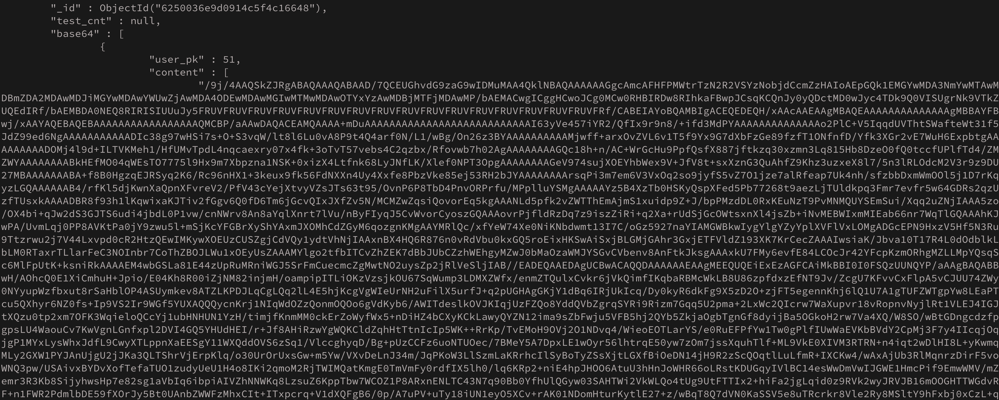

<br>

## 📦 Django DRF, ORM, Mysql를 이용한 서버 Application 개발

### Serializer를 활용한 API 서버 개발

- RESTful API 적용
- AbstractUser 기반 JWT Authentication 적용
- Django hashers를 활용한 비밀번호 암호화
- Serializer를 통한 Input 데이터 검증
- raise_exception=True에 따른 예외 핸들링

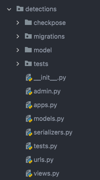

### RESTful API 적용

자원 및 참조 명시 및 GET, POST, PUT, DELETE

```python
app_name = "accounts"
urlpatterns = [
    path('', views.accounts, name="accounts"), # POST: 회원가입(DB), DELETE : 회원탈퇴
    path('time/', views.time, name="time"), # GET: 조회, PUT: 수정
]

app_name = "detections"
urlpatterns = [
    path('neck/', views.check_neck, name="check_neck"), # POST : 거북목 설정 (초기 4회) & 거북목 체크 (5회 이상)
    path('blink/', views.check_blink, name="check_blink"), # POST : 눈 깜박임 체크
]

app_name = "reports"
urlpatterns = [
    path('', views.reports, name="report_list") # POST : 단일 저장, GET : 전체 조회
]
```


### djangorestframework-jwt의 업데이트 종료, 파생 라이브러리 simplejwt를 활용하여 jwt 구현

```python
from rest_framework_simplejwt.views import (
    TokenObtainPairView,
    TokenRefreshView,
)

urlpatterns = [

    # Accounts
    path('api/admin/', admin.site.urls),
    path('api/accounts/login/', TokenObtainPairView.as_view(), name='token_obtain_pair'),
    path('api/token/refresh/', TokenRefreshView.as_view(), name='token_refresh'),
    path('api/accounts/', include('accounts.urls')),

    # Detections
    path('api/detections/', include('detections.urls')),

    # Reports
    path('api/reports/', include('reports.urls')),
]
```


### Django hashers를 활용한 비밀번호 암호화

```python
class AccountSerializer(serializers.ModelSerializer):

    def validate_password(self, value: str) -> str:
        """
        Hash value passed by user.
        :param value: password of a user
        :return: a hashed version of the password
        """
        return make_password(value)

    class Meta:
        model = get_user_model()
        fields = ('username', 'password')
```


### Serializer를 통한 Input 데이터 검증 & raise_exception=True에 따른 예외 핸들링

```python
class CheckNeckSerializer(serializers.ModelSerializer):

    class Meta:
        model = NeckDetection
        fields = ('blob_data', 'face_x', 'face_y', 'nose_to_center', 'cnt', 'face_x_mean', 'face_y_mean', 'nose_mean', 'detection_flag')
```

```python
if serializer.is_valid(raise_exception=True):

        # ================= Common ======================
        # Image
        image_base64 = serializer.data.get("blob_data")[22:]
        image_bytes = base64.b64decode(image_base64)
        image_1darray = np.frombuffer(image_bytes, np.uint8)
        image_3darray = cv.imdecode(image_1darray, cv.IMREAD_COLOR)
```

<br>

## 👱🏼‍♂️ Pytest를 활용한 테스트 코드 구현 및 AI 응답시간 측정

### 구조

- 인증방식 모듈화 ⇒ 회원가입 및 로그인 [Authentication.py](http://Authentication.py)
- base64로 인코딩된 blob 데이터를 txt파일로 저장
- 해당 데이터를 가져올 함수 모듈화 ⇒ get_base64.py
- 거북목 / 깜박임 탐지, 리포트, 회원 관련 기능 등
- AI 속도 측정 ⇒ request 반복 100개 전송 후 측정

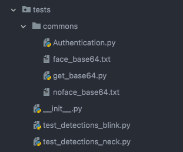


#### 인증 모듈화

Authentication.py

```python
def signup_login(client):
    # ===== Signup =====
    data = {
        "username": "testuser",
        "password": "12341234"
    }
    url = '/api/accounts/'

    client.post(url, data=data, content_type="application/json")
    # ===== END Signup =====

    # ===== Login =====
    data = {
        "username": "testuser",
        "password": "12341234"
    }
    url = '/api/accounts/login/'

    response = client.post(url, data=data, content_type="application/json")
    access_token = response.data.get("access")
    # ===== END Login =====

    return access_token
```

<br>

#### base64 get 모듈

```python
def get_base64_encoded_blob(face_type):
    if face_type == "face":
        with open("/Users/gkuer/Desktop/S06P22B201/backend/detections/tests/commons/face_base64.txt") as f:
            base64 = f.read()

    elif face_type == "noface":
        with open("/Users/gkuer/Desktop/S06P22B201/backend/detections/tests/commons/no_face_base64.txt") as f:
            base64 = f.read()

    return base64
```

<br>

#### 테스트 코드

```python
@pytest.mark.django_db
def test_detections_neck_with_face(client):
    access_token = Authentication.signup_login(client)

    url = '/api/detections/neck/'
    data = {
        "blob_data": get_base64.get_base64_encoded_blob("face"),
        "face_x": "1,1",
        "face_y": "11,11",
        "nose_to_center": "11,11",
        "cnt": 1,
        "face_x_mean": 3.0,
        "face_y_mean": 4.0,
        "nose_mean": 5.0,
        "detection_flag": ""
    }

    response = client.post(url, HTTP_AUTHORIZATION=f'Bearer {access_token}', data=data, content_type="application/json")

    assert response.status_code == 200
    assert response.data == {
    "face_x": [
        "1",
        "1",
        76.25
    ],
    "face_y": [
        "11",
        "11",
        107.58888888888889
    ],
    "nose_to_center": [
        "11",
        "11",
        19.011111111111106
    ],
    "cnt": 2,
    "face_x_mean": 0,
    "face_y_mean": 0,
    "nose_mean": 0,
    "detection_flag": "detected"
}
```


<br>

#### AI 속도측정 테스트

```python
@pytest.mark.django_db
def test_detections_neck_with_face_100(client):
    access_token = Authentication.signup_login(client)

    url = '/api/detections/neck/'
    data = {
        "blob_data": get_base64.get_base64_encoded_blob("face"),
        "face_x": "1,1",
        "face_y": "11,11",
        "nose_to_center": "11,11",
        "cnt": 1,
        "face_x_mean": 3.0,
        "face_y_mean": 4.0,
        "nose_mean": 5.0,
        "detection_flag": ""
    }

    start = time.time()
    cnt = 0
    for _ in range(100):
        response = client.post(url, HTTP_AUTHORIZATION=f'Bearer {access_token}', data=data, content_type="application/json")
        if response.status_code == 200:
            cnt += 1

    elapsed_time = time.time() - start

    assert elapsed_time <= 2.5
    assert cnt == 100
```

- 거북목 감지 - 1초에 한번 요청 ⇒ 1번 요청당 Response까지 AI 및 리턴 수행 속도 0.02초 ( OK )
- 깜박임 감지 - 0.5초에 한번 요청 ⇒ 1번 요청당 Response까지 AI 및 리턴 수행 속도 0.02초 ( OK )

<br>

### 결과

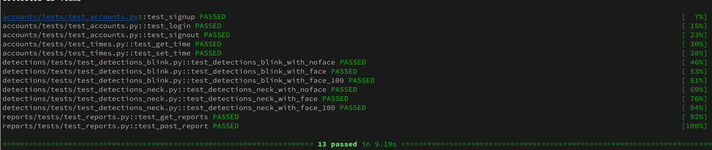

<br>


## 👱🏼‍♂️ AWS(EC2), Nginx, Gunicorn을 활용한 배포

#### Django - Gunicorn 연결

- Git Pull ⇒ pip install -r requirements.txt ⇒ python [manage.py](http://manage.py) migrate

- Gunicorn 설치 및 서버실행

  - pip install gunicorn
  - gunicorn --bind 0.0.0.0:8000 posemart.wsgi:application

- Gunicorn 설정 후 시스템 데몬 시작 및 서비스 실행, 등록

  ```shell
  [Unit]
  Description=gunicorn demon
  After=network.target
  
  [Service]
  User=ubuntu
  Group=www-data
  WorkingDirectory=/home/ubuntu/S06P22B201/backend
  ExecStart=/home/ubuntu/S06P22B201/backend/venv/bin/gunicorn --workers3 --bind 0.0.0.0:8000 \ posesmart.wsgi:application
  
  [Install]
  WantedBy=multi-user.target
  ```

  - sudo systemctl daemon-reload ⇒ sudo systemctl start gunicorn ⇒ sudo systemctl enable gunicorn

<br>

#### Gunicorn - Nginx 연결

- Nginx 설치

  - sudo apt-get install -y nginx

- Nginx 설정 및 링크 걸기

  ```nginx
  server {
    listen 7000 ssl;
    server_name j6b201.p.ssafy.io;
    
    ssl_certificate /etc/letsencrypt/live/j6b201.p.ssafy.io/fullchain.pem;
    ssl_certificate_key /etc/letsencrypt/live/j6b201.p.ssafy.io/privkey.pem;
    
    location /static {
      root /home/ubuntu/S06P22B201/backend/staticfiles;
    }
    
    location /api {
      include proxy_params;
      proxy_pass http://0.0.0.0:8000/api;
    }
  }
  ```

  - sudo ln -s /etc/nginx/sites-available/mysite.conf /etc/nginx/sites-enabled

<br>

#### Certbot을 활용한 HTTPS 적용

- certbot 설치
  - sudo snap install --classic certbot
- 심볼릭 링크
  - sudo ln -s /snap/bin/certbot /usr/bin/certbot
- 자동 설정
  - sudo certbot --nginx
- 443 포트 열기


<br>

## 👱🏼‍♂️ Docker Hub / Jenkins / Docker를 활용한 CI/CD

##### Git Push ⇒ Docker Hub에서 감지 및 이미지 생성 ⇒ Jenkins에서 감지 및 이미지 pull 및 빌드 ⇒ Docker를 통한 배포

<br>

### 1. Github Dockerfile 기준 이미지 빌드

- Webhook을 통해 Docker Hub ⇒ Git 바라볼 수 있도록
- 함께 Push된 Docker file 기준으로 이미지 빌드

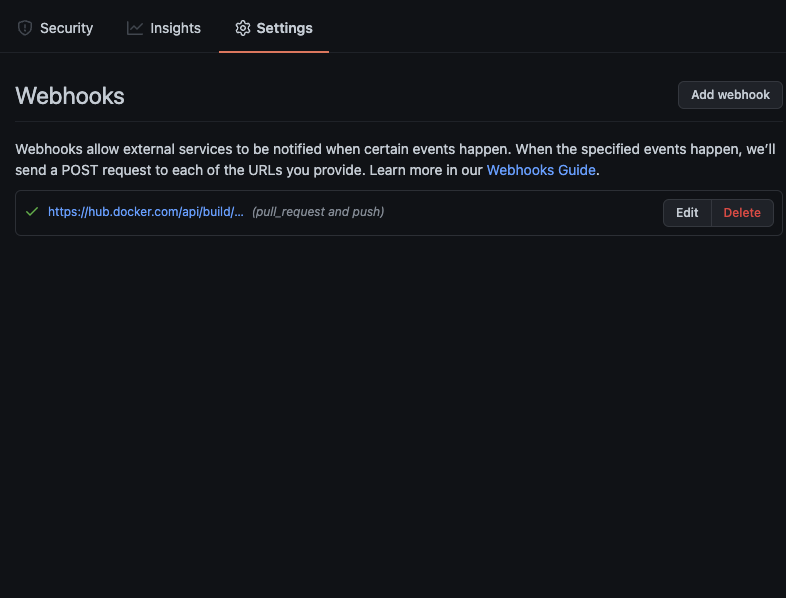

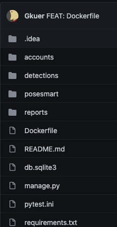

<br>

### 2. Docker Hub에서 빌드 및 로그 확인

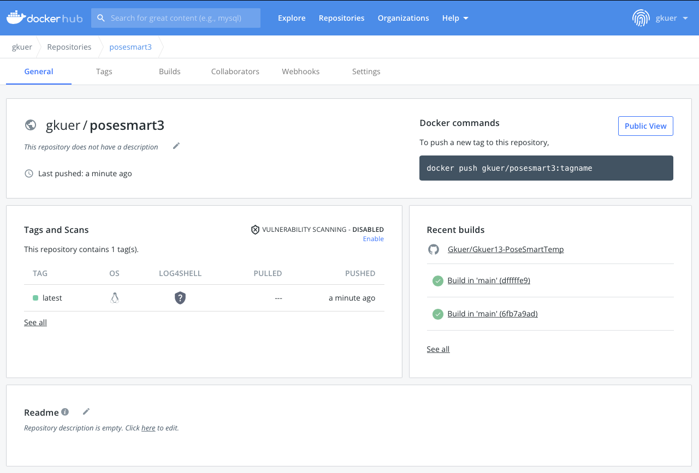

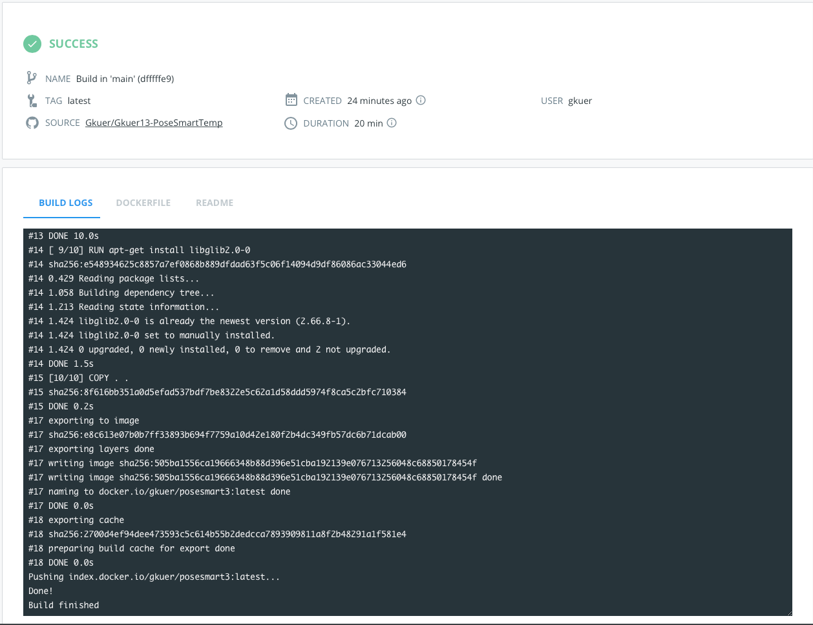

<br>

### 3. Docker Hub ⇒ Jenkins Webhook 설정

- Docker Hub

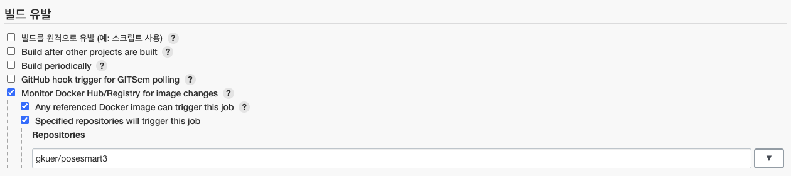

- Jenkins


### 4. Jenkins에서 Push 받으면 자동 Pull / Execute Shell 실행

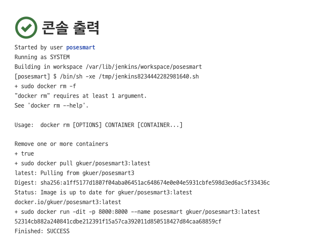

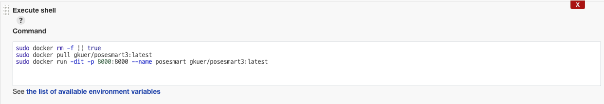

- 기존 이미지 제거 후 새로운 pull 및 실행
- Jenkins가 Docker를 제어할 수 있는 sudo 권한 부여

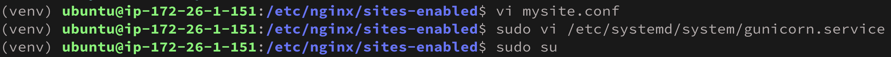

<br>

### 5. Docker 이미지를 통한 배포

- Gunicorn 확장 후 노출

- AWS-Mysql-Django-Nginx 연결

- 기존 Docker 이미지를 통한 배포 ⇒  Git + Docker Hub + Jenkins를 통한 자동화

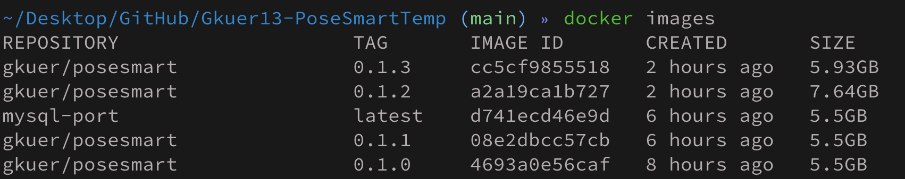

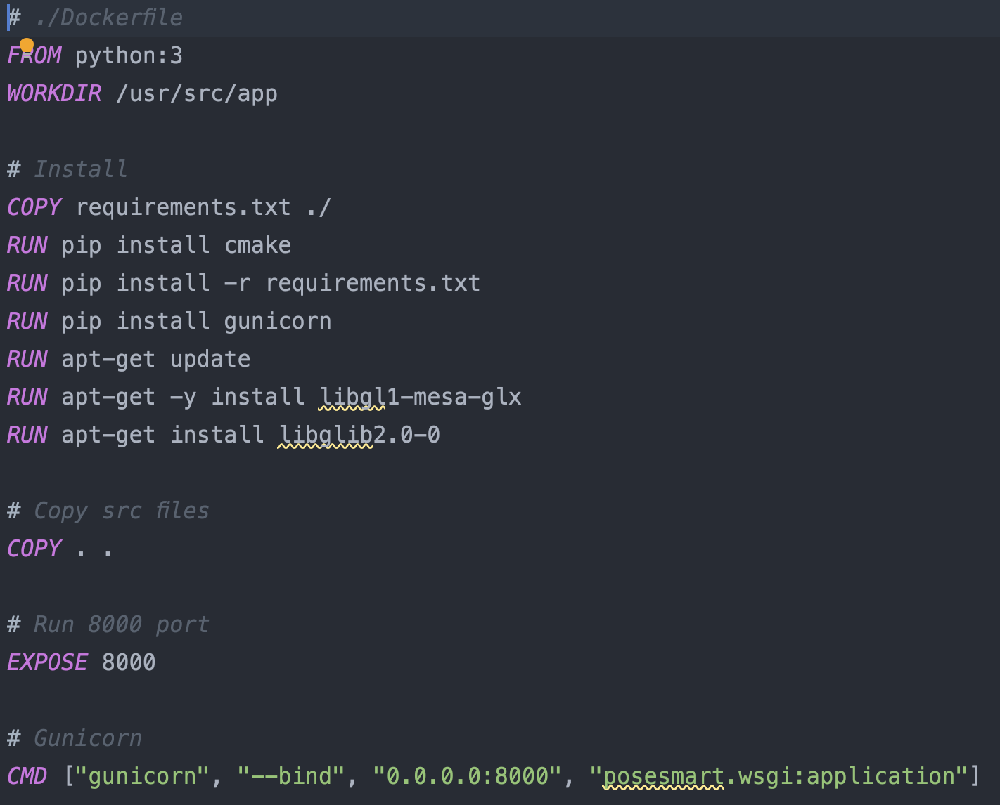

<br><br>

## 🏃 함께 성장하고 만들어가던 과정들

### 서비스 아키텍처

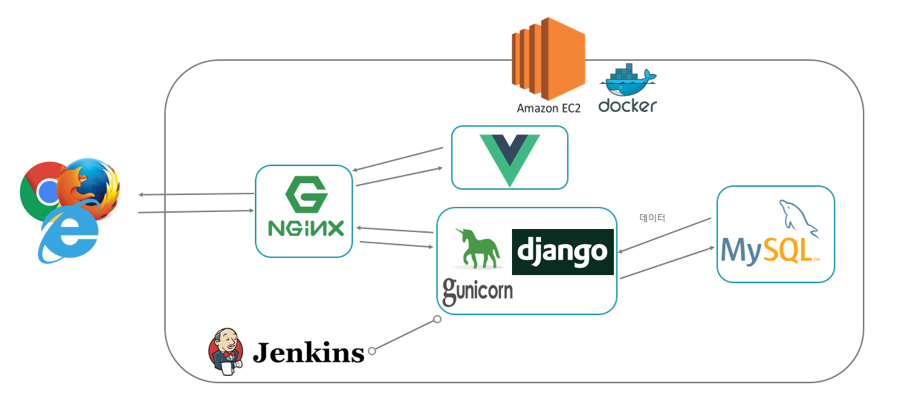

### 요구사항 정의서

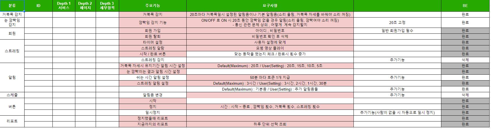

### Gitlab

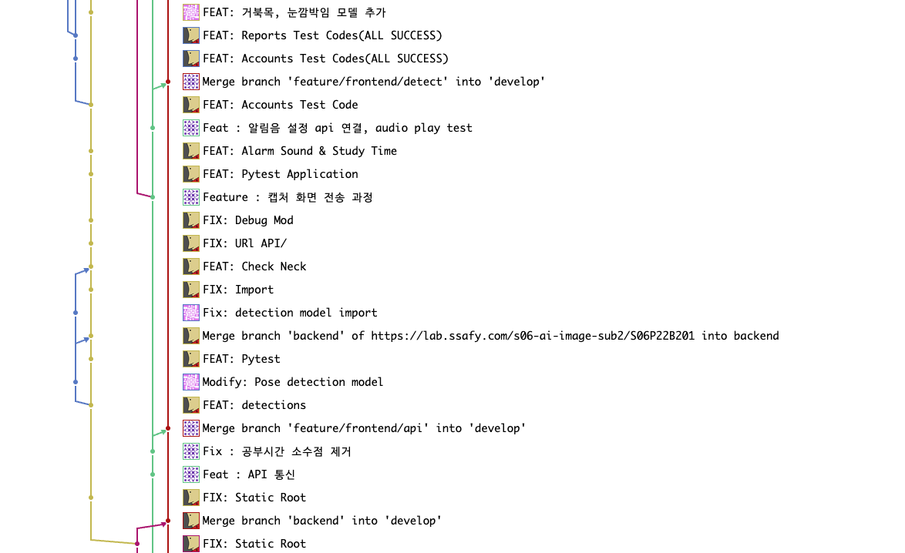

### Jira

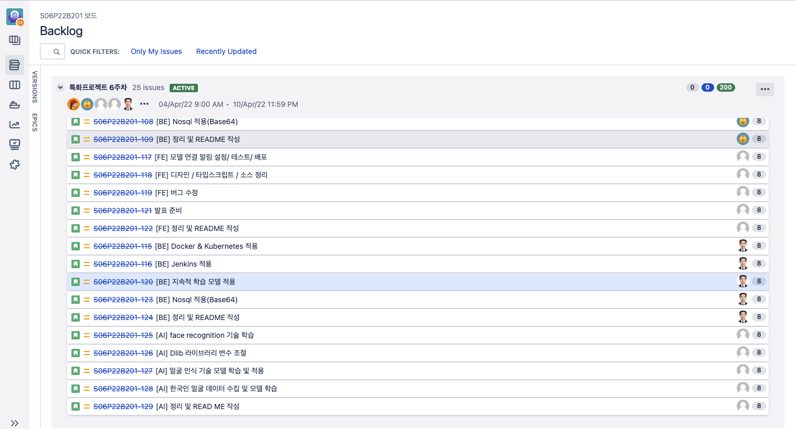

### Notion

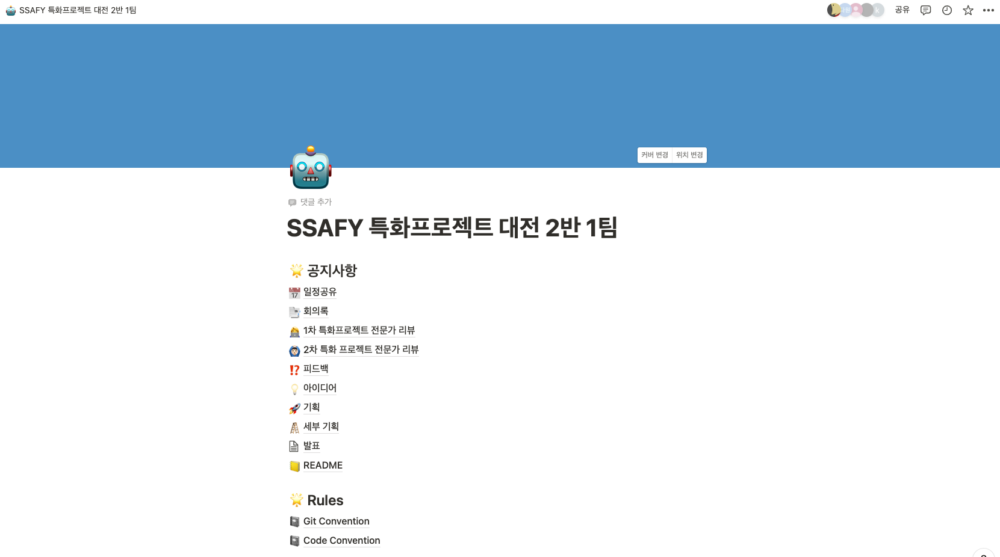

### Mattermost

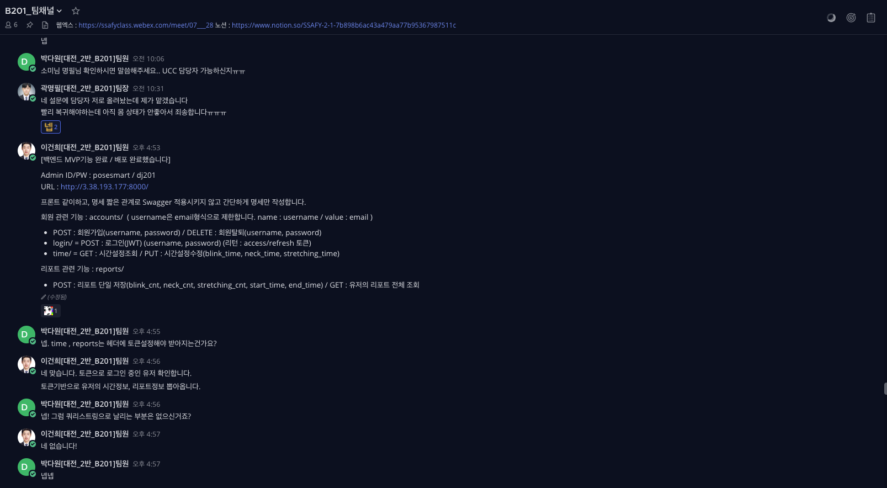

### Webex

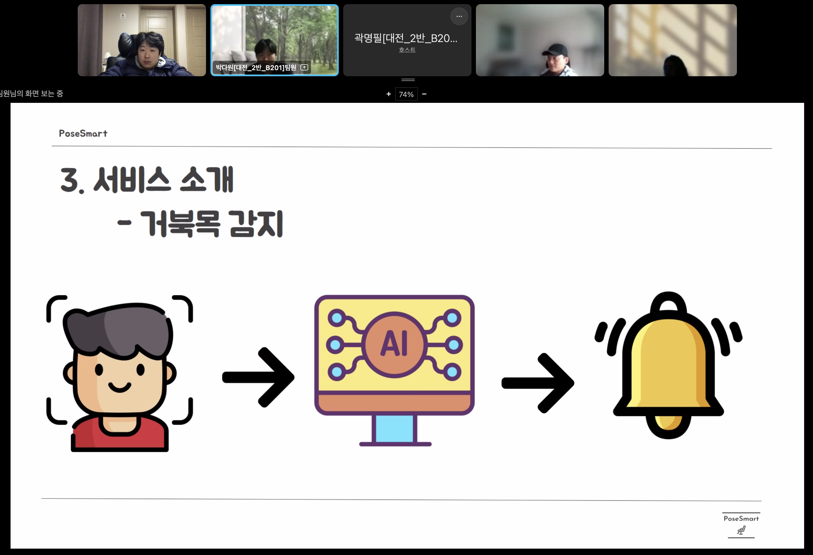


## 🫧 Sceen

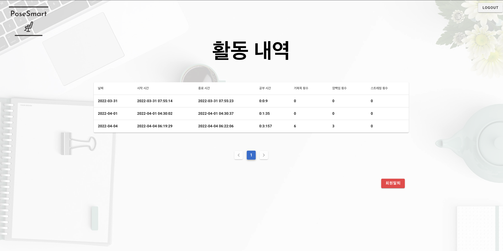

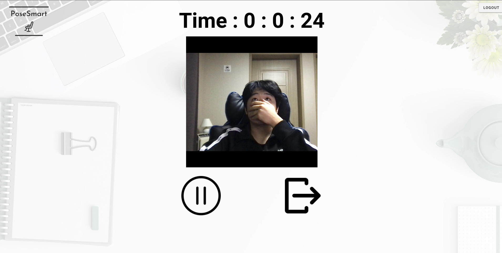


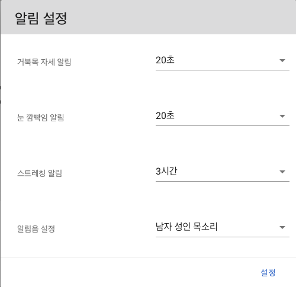


